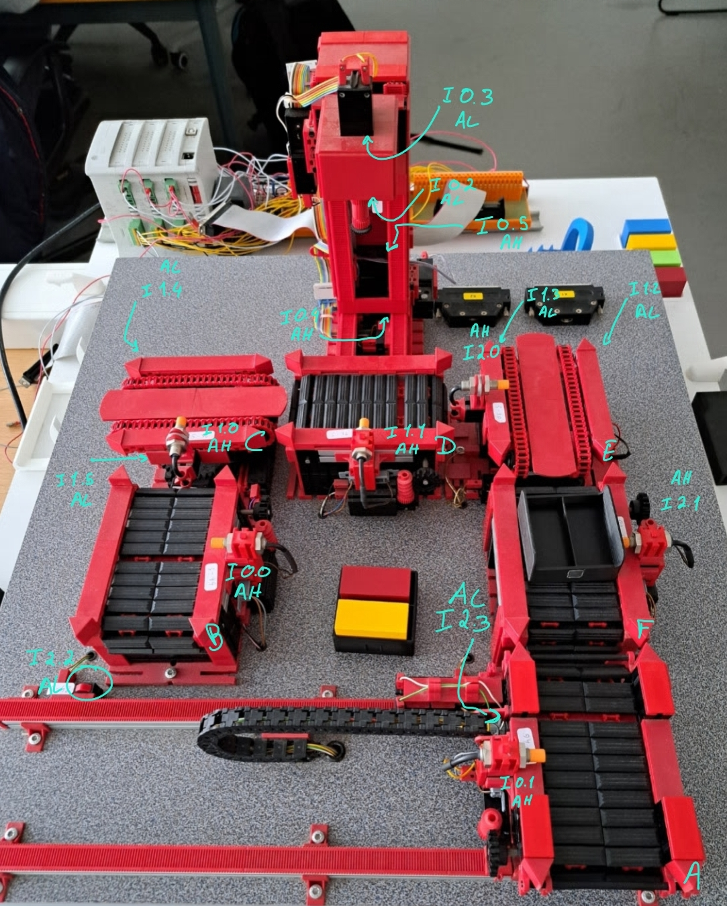

<div  align="center"> 

# Open Modular Controller for Automation Technologies
[](https://opensource.org/licenses/MIT)
[](https://doi.org/10.1109/ETFA61755.2024.10710730)

[Nelson Freitas](https://scholar.google.com/citations?user=BDOCGnoAAAAJ&hl=pt-PT&oi=ao)<sup>1</sup>, 
[Miguel Arvana](https://scholar.google.com/citations?user=UBvr388AAAAJ&hl=pt-PT)<sup>1</sup>,
[Tiago Gouveia](https://www.linkedin.com/in/tiago-gouveia-1552a529b/)<sup>1</sup>, 
[Raúl Mestre Dinis](https://www.linkedin.com/in/ra%C3%BAl-mestre-dinis/)<sup>1</sup>,
[Daniela Machado]()<sup>1</sup>,
[Andre Rocha](https://scholar.google.pt/citations?user=k1GIyqcAAAAJ&hl=pt-PT)<sup>1</sup>,
[Jose Barata](https://scholar.google.pt/citations?user=4G8tKCsAAAAJ&hl=en)<sup>1</sup>

<sup>1</sup> **NOVA School of Science and Technology, Center of Technology and Systems (UNINOVA-CTS)**,
and Associated Lab of Intelligent Systems (LASI), NOVA University
Lisbon, 2829-516 Lisbon, Portugal

<table>
  <tr>
    <td style="vertical-align: top;">
      This article proposes a framework integrating Cyber-Physical Production Systems with Digital Twins to understand manufacturing systems and enhance their functionality comprehensively. The framework comprises three layers: Physical Assets, Modular Cyber-Physical Production System, and Digital Twin. Utilising Multi-Agent systems, the Modular Physical Production System orchestrates production processes, optimises efficiency, and ensures adaptability to market fluctuations. Meanwhile, the Digital Twin serves as a real-time representation of the physical system, facilitating monitoring, interaction, and understanding of the system's behaviour. The implementation involves creating 3D models using Blender and a virtual environment using Unity.
    </td>
    <td style="vertical-align: top;">
      
    </td>
  </tr>
</table>

</div>

## <div align="center">Get Started</div>
Follow these steps to setup the FMS-Kit controller and digital twin:

1. **Industrial Shields 57R+**
    ### Ports

    In order to connect the controller with the kit, the following ports where used:

    <div align="center" style="display: flex; justify-content: space-around; gap: 20px; flex-wrap: wrap;">
      <div style="flex: 1; min-width: 300px;">

    ## Sensors I
    | Number | Index | Function         | Active |
    |--------|-------|------------------|--------|
    | 0      | 0     | Conveyor B       | High   |
    | 0      | 1     | Conveyor A       | High   |
    | 0      | 2     | Punch Down       | Low    |
    | 0      | 3     | Punch Up         | Low    |
    | 0      | 4     | Punch Forward    | High   |
    | 0      | 5     | Punch Backward   | High   |
    | 1      | 0     | Conveyor C       | High   |
    | 1      | 1     | Conveyor D       | High   |
    | 1      | 2     | Rotate E Give    | Low    |
    | 1      | 3     | Rotate E Receive | Low    |
    | 1      | 4     | Rotate C Give    | Low    |
    | 1      | 5     | Rotate C Receive | Low    |
    | 2      | 0     | Conveyor E       | High   |
    | 2      | 1     | Conveyor F       | High   |
    | 2      | 2     | Conveyor A Left  | Low    |
    | 2      | 3     | Conveyor A Right | Low    |
    | 2      | 4     | -                | -      |
    | 2      | 5     | -                | -      |

      </div>
      <div style="flex: 1; min-width: 300px;">

    ## Actuators R
    | Number | Index | Function             |
    |--------|-------|----------------------|
    | 0      | 0     | -                    |
    | 0      | 1     | -                    |
    | 0      | 2     | Punch Up             |
    | 0      | 3     | Punch Forward        |
    | 0      | 4     | Conveyor E           |
    | 0      | 5     | Conveyor E Receive   |
    | 0      | 6     | Conveyor C Give      |
    | 0      | 7     | Conveyor A Backwards |
    | 0      | 8     | Conveyor A Right     |
    | 1      | 0     | -                    |
    | 1      | 1     | -                    |
    | 1      | 2     | -                    |
    | 1      | 3     | Punch Down           |
    | 1      | 4     | Conveyor F           |
    | 1      | 5     | Rotate C Give        |
    | 1      | 6     | Conveyor C           |
    | 1      | 7     | Conveyor B           |
    | 1      | 8     | Conveyor A Left      |
    | 2      | 3     | Punch Spin           |
    | 2      | 4     | Punch Forward        |
    | 2      | 5     | -                    |
    | 2      | 6     | Conveyor D           |
    | 2      | 7     | Conveyor C Receive   |
    | 2      | 8     | Conveyor A Forward   |

      </div>
    </div>

    ### Setup
  
    In order to use the controller, the correct board package must be installed in your Arduino IDE. This can be done in 2 ways:
    1. Arduino way
        - Inside your Arduino IDE, go to *Preferences*
        - Copy the link ```http://apps.industrialshields.com/main/arduino/boards/package_industrialshields_index.json``` to your *Additional boards manager URLs* parameter.
        - Save and exit
    2. Repository way
        - Place the libraries found in the repository at [libraries](./src/Arduino/libraries/) inside your arduino libraries folder.
        - Place Industrial Shields boards package found in the repository at [package](./src/Arduino/boards%20package/) in your arduino package's folder.

      To complete the setup

    - Open your *Boards Manager* (Ctrl + Shift + B)
    - Install the ```industrialshields-avr``` boards package.
    - Select the ```M-Duino family``` board.
    - Select the ```M-Duino 57R+``` model.
    - Locate the developed Arduino Code in the repository [here](./src/Arduino/KIT_FMS_DigitalShadow/KIT_FMS_DigitalShadow.ino).
    - Edit the IP configuration present in the start of the code to your desired configuration.
    - Upload the code to the controller.

1. **HMI App Instalation**

    ### Setup
   - Locate the Kit FMS APK files in the repository at [Kit FMS.apk](./src/HMI/Kit%20FMS.apk).
   - Execute apk in a android mobile device of your choosing.

2. **Digital Twin Deployment**
    ### Setup
   - Execute the file Kit FMS.exe in the repository at [Kit FMS.exe](./src/Unity/Exec/Kit%20FMS.exe).
   

3. **IP Configuration**

    1. HMI IPs

        - In the DT, press "DEBUG" in the top left corner.
        - In the HMI, press "CHANGE IP", place the IP found in the DT's DEBUG Interface.

    2. DT IPs

        - In the DT, press "SETTINGS" in the top left corner.
        - Place the "TABLET IP" found in your mobile device. 
        - Place the "Arduino IP" found in your controller's arduino code. 

If all steps are followed, your system is now ready for operation.

## Usage instructions

### Everytime the system is turned off

  1. Start Kit FMS DT
  2. Start Kit FMS HMI
  3. Open the Agents IntelliJ Project found in the repository [here](./src/Agents/CTS_Andre).
  4. Run the Agents Program
  6. In the Kit FMS DT, press "CONNECT" on the top left corner
  
> **NOTE:** In order to verify the setup, go to the "DEBUG" menu in the DT and see that both Agents and Tablet status are "ON".

### How to launch a product ?

1. In the HMI, position the operator in the desired side by pressing "LEFT" or "RIGHT". 
2. In the DT, press "SETUP" on the top left corner and setup the skills that will be available for the operators.
3. In the DT, press "LAUNCH" on the top left corner specify wich actions the product must do.
4. Launch the product.

> **NOTE:** It is recomended to place 2 coloured parts in each launch as the system may bug with only 1.

## Project Structure
For you to better understand this repository organization, here is a quick overview of its structure and where to find what you might be looking for:
```
FMS
├── docs                            # documentation assets
│   └── paper.pdf                       # related investigation work
├── imgs                            # images from this project
├── 3D Models                       # 3D models developed and used in the project
├── src                             # developed code
│   ├── Agents                          # Multi Agent System code
│   │   ├── CTS_Andre                       # developed agents intelij project
│   │   └── jade                            # agents library
│   ├── Arduino                         # Industrial Shields 57+ arduino code
│   │   ├── KIT_FMS_DigitalShadow           # arduino code
│   │   └── libs                            # arduino libraries
│   ├── DT                              # DT code
│   │   ├── Exec                            # DT executable
│   │   └── Source                          # DT Unity project
│   └── HMI                             # HMI code
│       ├── Kit FMS                         # HMI apk
│       └── HMIUnity                        # HMI Unity project
└── README                              # this document
```

## <div align="center">Documentation</div>
The [docs](./docs/) directory contains related investigation work conducted on the implemented system

### Services

The available services are divided in 2 sections:

- #### Transportation
  Comands to control the product movements from a conveyor to another.

  - Transport AB - Move product from Conveyor A to Conveyor B
  
    ```192.168.x.x:80/passadeiras?skill=AB```
  - Transport BC - Move product from Conveyor B to Conveyor C
  
    ```192.168.x.x:80/passadeiras?skill=BC```
  - Transport CD - Move product from Conveyor C to Conveyor D
  
    ```192.168.x.x:80/passadeiras?skill=CD```
  - Transport DE - Move product from Conveyor D to Conveyor E
  
    ```192.168.x.x:80/passadeiras?skill=DE```
  - Transport EF - Move product from Conveyor E to Conveyor F
  
    ```192.168.x.x:80/passadeiras?skill=EF```
  - Transport FA - Move product from Conveyor F to Conveyor A
  
    ```192.168.x.x:80/passadeiras?skill=FA```

- #### Stations
  Comands to control the skills tower.

  - Drill - Tower performs a drill on the product
  
    ```192.168.x.x:80/statacao?skill=0```
  - Screw - Tower performs a screw on the product
  
    ```192.168.x.x:80/statacao?skill=1```
  - Calibrate - Calibrate Tower

    ```192.168.x.x:80/statacao?skill=2```

### Comunication

  #### Controller -> DT

  Once the Unity is conected, the Controller sends each sensor change separately.

  - Server IP: http://localhost:8080/

  - Technology: Sockets
  
  - Format: JSON
  
  - Message Template:
  
    ```
    {
      "Port" : "R1_0",
      "Value" : "1"
    }
    ```
 #### HMI -> DT

  This is how the HMI is able to inform the DT about the when, where and what color of a placed piece.

  - Server IP: http://localhost:8082/

  - Technology: HTTP Post
  
  - Format: JSON
  
  - Message Template:
  
    ```
    {
      "Position" : "1",
      "Color" : "Red"
    }
    ```

## <div align="center">Contribution Guidelines</div>
NOVA RICS Open Lab open source, and we welcome contributions from the community! See the [Contribution](CONTRIBUTING.md) guide for more information on the development workflow and the internals of the wandb library. For project related bugs and feature requests, visit [GitHub Issues](https://github.com/NOVA-RICS-Open-Lab/open-modular-controller/issues) or contact novaricsopenlab@gmail.com

## <div align="center">Citation</div>
If you use or intend to build on top of  the work in this repo, please consider citing our project:
```bibtex
@INPROCEEDINGS{10710730,
  author={Rocha, Andre Dionisio and Arvana, Miguel and Freitas, Nelson and Dinis, Raul Mestre and Gouveia, Tiago and Machado, Daniela and Barata, Jose},
  booktitle={2024 IEEE 29th International Conference on Emerging Technologies and Factory Automation (ETFA)}, 
  title={Human-Centric Digital Twin-Driven Approach for Plug-and- Produce in Modular Cyber-Physical Production Systems}, 
  year={2024},
  pages={1-7},
  keywords={Technological innovation;Fluctuations;Layout;Transportation;Collaboration;Production;Digital twins;Fourth Industrial Revolution;Complexity theory;Monitoring;Digital Twin;Industrial Cyber-Physical Systems;Modularity;Plug-and-Produce;Reconfigurability;Multiagent Systems},
  doi={10.1109/ETFA61755.2024.10710730}}

```

## <div align="center">License</div>
This repository is released under the MIT License. Please see the [LICENSE](LICENSE) file for more details.

## <div align="center">Contacts</div>
For any questions regarding this or any other project please contact us at novaricsopenlab@gmail.com or enroll in our [Discussion Forum](https://github.com/NOVA-RICS-Open-Lab/open-modular-controller/discussions) for sharing your ideas and sharing projects.
